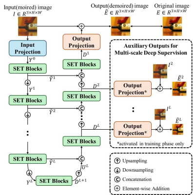
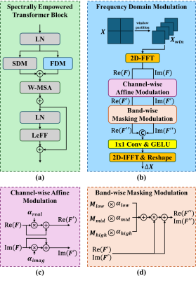

<div align="center">
<h2>Empowering Transformers Spectrally: Towards Comprehensive Pattern Learning for Image Demoir&eacute;ing</h2>

<div>    
    <a href='https://sylee-skhu.github.io/' target='_blank'>Sangyun Lee</a><sup>†1</sup>&nbsp&nbsp&nbsp&nbsp;
    <a href='mailto:sjhong@skhu.ac.kr' target='_blank'>Sungjun Hong</a><sup>1</sup>&nbsp&nbsp&nbsp&nbsp;
    <a href='mailto:swkwak@skhu.ac.kr' target='_blank'>Seung Woo Kwak</a><sup>1</sup>
</div>
<br>
<div>
    <sup>†</sup>Corresponding author</span>
</div>
<div>
    <sup>1</sup>Sungkonghoe University, Seoul, South Korea</span>
</div>
</div>

---

<h4>
This repository is the official PyTorch implementation of "Empowering Transformers Spectrally: Towards Comprehensive Pattern Learning for Image Demoir&eacute;ing". SEDT(Spectrally Empowered Demoir&eacute;ing Transformer) achieves state-of-the-art performance in image demoir&eacute;ing.
</h4>

## Network Architecture

<p align="center">
  &nbsp&nbsp&nbsp&nbsp&nbsp&nbsp&nbsp&nbsp
  
</p>

---
## 📧 News
- **Aug 21, 2025:** This repository is created

---
## Reference
```BibTeX
TBD
```
---

## Contents
- [Requirements](#requirements)
- [Data Preparation](#data-preparation)
- [Pretrained Model](#pretrained-model)
- [Training](#training)
- [Testing](#testing)
- [Results](#results)
- [License](#license)
- [Acknowledgement](#acknowledgement)

## Requirements
- Python 3.8.10
- CUDA 11.6
- NCCL 2.14.3

Install dependencies with:

```bash
pip install -r requirements.txt
```

## Data Preparation

### Download datasets

#### TIP-2018
refer to the [link](https://huggingface.co/datasets/zxbsmk/TIP-2018/tree/main).

directory structure:
```
data_tip
├── trainData
│   ├── source
│   │   ├ ****.png
│   │   └── ...
│   └── target
│       ├ ****.png
│       └── ...
└── testData
    ├── source
    │   ├ ****.png
    │   └── ...
    └── target
        ├ ****.png
        └── ...
```

#### UHDM
refer to the [script](scripts/download_uhdm.sh).

directory structure:
```
data_uhdm
├── train
│   ├── pair_00
│   │   ├ 0000_gt.jpg
│   │   ├ 0000_moire.jpg
│   │   └── ...
│   ├── pair_01
│   └── ...
└── test
    ├── 0000_gt.jpg
    ├── 0000_moire.jpg
    └── ...
```

## Pretrained Model

TBD

## Training
```bash
# Download code
git clone https://github.com/sylee-skhu/SEDT
cd SEDT

# Train SEDT-T on TIP-2018 dataset (with 4 GPUs)
torchrun --nproc_per_node 4 train.py --config ./config/sedt_t_tip_config.yaml

# Train SEDT-T on UHDM dataset (with 4 GPUs)
torchrun --nproc_per_node 4 train.py --config ./config/sedt_t_uhdm_config.yaml
```

## Testing
```bash
# Test SEDT-T on TIP-2018 dataset
torchrun --nproc_per_node 1 test.py --config ./config/sedt_t_tip_config.yaml

# Test SEDT-T on UHDM dataset
torchrun --nproc_per_node 1 test.py --config ./config/sedt_t_uhdm_config.yaml
```

## Profiling
```bash
python profile.py --config ./config/sedt_t_tip_config.yaml
```

## Acknowledgement
This work was supported by the Technology development Program(RS2024-00446202) funded by the Ministry of SMEs and Startups(MSS, Korea).